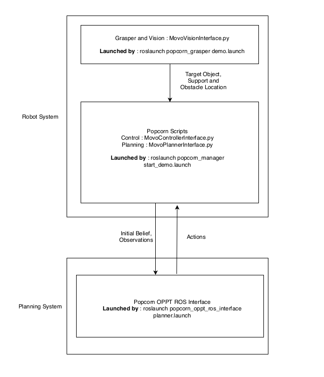
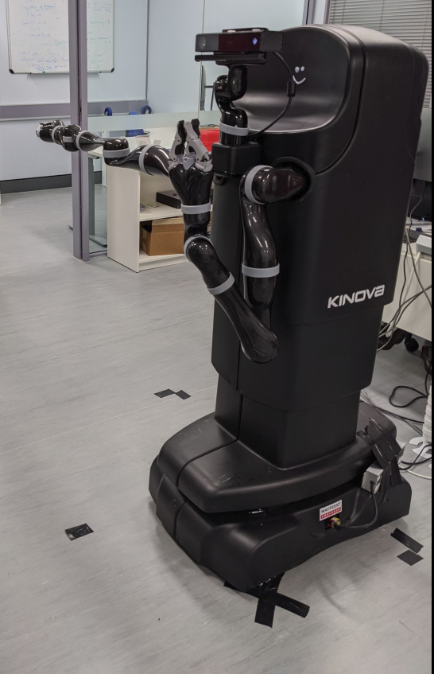
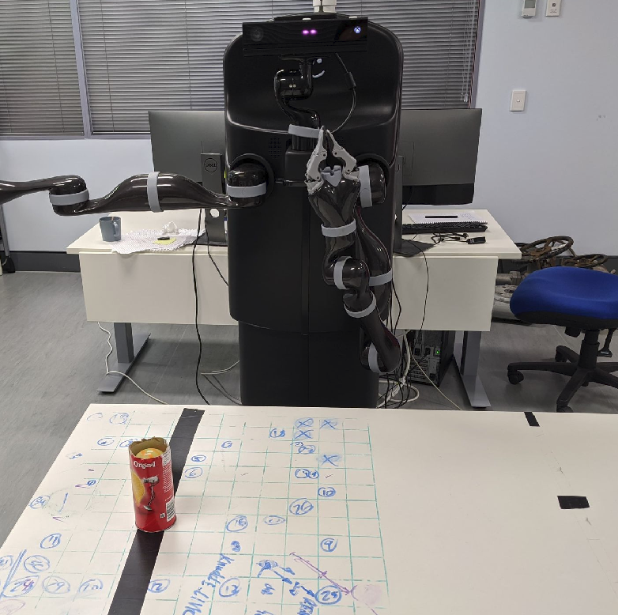

POMDP Simple Grasping Demo
==========================================================================
### Kinova MOVO
This program provides a demonstration of [OPPT](https://github.com/RDLLab/oppt) for grasping using Kinova's mobile manipulator [KINOVA MOVO](https://www.kinovarobotics.com/sites/default/files/OP-03_2019-05_R01.pdf). This demo covers a simplified grasping part of the work done in [[1]](#References) 

Specifically, the demo assumes that the robot runs on Ubuntu 16.04 (Xenial Xerus), with the default packages and dependencies provided
by Kinova. For details on the MOVO packages and dependencies, please refer to the "kinetic-devel" branch of [KINOVA MOVO GITHUB](https://github.com/Kinovarobotics/kinova-movo/tree/kinetic-devel).


### Demo Modules:
The demo program consists of two modules: 
- **[MOVO Module](movo):**
The MOVO Module contains the components that run on MOVO's internal computer *"movo2"*. This includes sensing and low level control.  
- **[Planner Module](planner):**
The Planner Module contains the motion planner and needs to be run on an independent computer outside of MOVO that we will refer as *"plannerPC"*.

### Overview of demo system
The following image shows top level description of the system used for the demo  
.


## Installation
The MOVO and Planner Module need to be installed in their corresponding systems.

### Using install scripts
This repository includes install scripts for both modules.
These install scripts will create a catkin workspace inside the cloned repository directory and compile the 
workspace inside. Ensure that each install script is executed in the appropiate computer system.

**Installation of MOVO Module:**
This module should be installed on the "movo2" pc of the mobile manipulator.

```bash
# Clone the repo into a desired location. In this example we will use the local Desktop and install the movo module
movo@movo2:~$ cd ~/Desktop
# Clone the repository
movo@movo2:~$ git clone https://github.com/RDLLab/oppt_movo_grasp.git
# Go into the repository
movo@movo2:~$ cd ~/Desktop/oppt_movo_grasp
# Make script executable
movo@movo2:~$ chmod +x movo_install.sh
# Launch install script
movo@movo2:~$ ./movo_install.sh
```


**Installation of Planner Module:**
This module should be installed on the independent computer outside of MOVO. The following example set of commands will install the Planner, all dependencies it requires, and the catkin workspace for the Planner module. This script requires sudo access to allow the POMDP solver, [OPPT](https://github.com/RDLLab/oppt), to install all its dependencies. 


```bash
# Clone the repo into a desired location. In this example we will use the local Desktop and install the movo module
planner@plannerPC:~$ cd ~/Desktop
# Clone the repository
planner@plannerPC:~$ git clone https://github.com/RDLLab/oppt_movo_grasp.git
# Go into the repository
planner@plannerPC:~$ cd ~/Desktop/oppt_movo_grasp
# Make script executable
planner@plannerPC:~$ chmod +x planner_install.sh
# Execute install script
planner@plannerPC:~$ ./planner_install.sh
```

### Manual installation
For a manual installation for each module, please refer to the [MOVO Module installation](movo/README.md) and [Planner Module installation](planner/README.md)


## Launching and Running the demo:
Before attempting to start the demo, please set your experimental scene according to the [Experimental Setup](#Experimental-Setup) instructions of this document.
To launch and run the demo, please execute the launch files for both modules in the demo, as follows:

1. First launch the Planner module to make sure its ready before starting the demo.  

**For the Planner module:**
```bash
# Source the setup file for the catkin workspace containing the Planner module
planner@plannerPC:~$ source <PLANNER_MODULE_WS>/devel/setup.bash
# Source the oppt resource path
planner@plannerPC:~$ source <PLANNER_MODULE_WS>/install/share/oppt/setup.sh
# Launch the planner
planner@plannerPC:~$ roslaunch popcorn_oppt_ros_interface planner.launch
```

2. Then we execute the launch files from the MOVO module as follows:

**For the MOVO module:**
```bash
# Source the catkin_ws setup file
movo@movo2:~$ source <MOVO_MODULE_CATKIN_WS>/devel/setup.bash
```

- Run launchfile to initialize sensors of the robot for the demo.

``` bash
# Run this version if using the default vision module
movo@movo2:~$ roslaunch popcorn_grasper demo.launch static_table:={true,false}  

# Run this version if using your own vision module. Make sure you read the documentation on  
# guides/VisionReadme.md for more details.
movo@movo2:~$ roslaunch popcorn_grasper demo.launch use_default_vision:=false static_table:={true,false}
```  

- On a new terminal, run launchfile to initialize demo execution.  
``` bash
# Source the catkin_ws setup file
movo@movo2:~$ source <MOVO_MODULE_CATKIN_WS>/devel/setup.bash
# Start demo
movo@movo2:~$ roslaunch popcorn_manager start_demo.launch
```

### Networking setup
To ensure that the components in the MOVO module can interact with the Planner module running on a separate computer, check that 
both systems can talk through a ROS network. Refer to [guides/Networking.md](guides/Networking.md) for more information. 


## Experimental Setup:

### Experimental Scene:
For this demo, please ensure that there is a free and uncluttered surrounding to your robot.  



The image above, shows an example setup for our experimental scene  
### Table and Target Object Information:
Before running the demo, enter your experimental setup by setting your choice of table and target objects dimensions under "table" and "tube" descriptions respectively. This information is required as input to the demo. Refer to the "User input to demo" section in [guides/ExperimentalGuide.md](guides/ExperimentalGuide.md) for more information.

### Target Object:
The target object tested on for this demo was a pringles tube with radius = 3.5cm and height = 13.5cm .
However, other cylindrical objects with similar or larger heights and similar radiuses should work as well. 
Refer to the *Using a different target object* section in [guides/ExperimentalGuide.md](guides/ExperimentalGuide.md) for more information. In general, the restrictions on shape and size are due to the vision component. This vision component can be changed. See [guides/VisionReadme.md](guides/VisionReadme.md) for how to change the vision component. 

### Table into the Scene:
To ensure the robot does not collide with the table prior to running the demo program, we provide initialisation programs that need to be run prior to running the demo. The initialisation program has the following two options.


**Using a static table**:
If a static table is used to try this demo, please ensure that both arms of the manipulator are above the table and at a suitable configuration to not obstruct the camera from scanning the scene.
1. Follow the launching instructions on the *Launching and Running the demo* section above.
When launching 'popcorn_grasper demo.launch', use static_table:=true


**Using a movable table**:
If a movable table is used, 
1. Clear the scene or bring the robot to a clear space, and launch the Planner module by following step 1 of the [Launching and Running](#Launching-and-Running-the-demo) section above. 

```bash
# Source the setup file for the catkin workspace containing the Planner module
planner@plannerPC:~$ source <PLANNER_MODULE_WS>/devel/setup.bash
# Source the oppt resource path
planner@plannerPC:~$ source <PLANNER_MODULE_WS>/install/share/oppt/setup.bash
# Launch the planner
planner@plannerPC:~$ roslaunch popcorn_oppt_ros_interface planner.launch
```

2. Launch 'popcorn_grasper demo.launch static_table:=false' as per step 2 of the [Launching and Running](#Launching-and-Running-the-demo) section above. 

```bash
# Run this version if using the default vision module
movo@movo2:~$ roslaunch popcorn_grasper demo.launch static_table:=false
# Run this version if using your own vision module. Make sure you read the documentation on 
# The vision directory for more details on how to do it.
movo@movo2:~$ roslaunch popcorn_grasper demo.launch use_default_vision:=false static_table:=false
```
3. Bring the table into the scene after executing the launch file in step 2

   

The image above shows an example of our experimental scene after executing this third step  

4. On a new terminal, execute the remaining step from [Launching and Running](#Launching-and-Running-the-demo) section above. 
by running

```bash
# Source the catkin_ws setup file
movo@movo2:~$ source <MOVO_MODULE_WS>/devel/setup.bash
# Run launchfile to initialize demo execution.
movo@movo2:~$ roslaunch popcorn_manager start_demo.launch

```


### Performance:
The demo was evaluated within a testing region of 50cm x 50cm with 
- lower_bound.x = 0.60m  
- lower_bound.y = -0.25m  
- upper_bound.x = 1.1m  
- upper_bound.y = 0.25m

These bounds are defined with respect to the coordinate system attached to the base link of the robot. 

Out of 80 trial runs within this region, we achieve a success rate of 90%.


## License:
This demo is under the [GPL-2 LICENSE](Licenses/GPL-2.txt). 
Additionally, this project uses the source code provided by Kinova Robotics, and OPPT. 
All licenses for this demo can be found at [LICENSES](Licenses).

## References
<ol>
<li>Marcus Hoerger, Joshua Song, Hanna Kurniawati, and Alberto Elfes. POMDP-based Candy Server: Lessons Learned from a Seven Day Demo. Proc. Int. Conference on Automated Planning and Scheduling (ICAPS). 2019.</li>
</ol>


